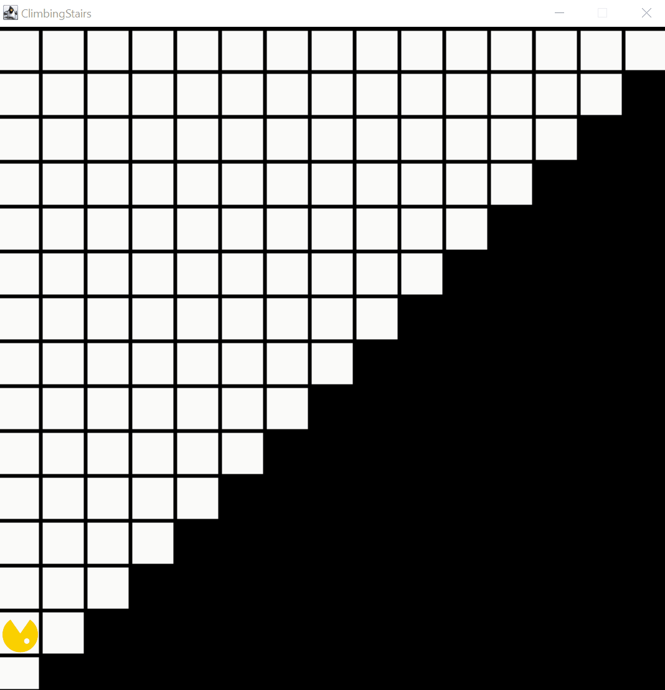

# Climbing Stairs

Bouncer klettert in diesem Beispielprogramm auf eine beliebig hohe Treppe hinauf. Die Stufen dieser Treppe sind dabei jeweils genau ein Feld breit und ein Feld hoch. Die letzte Stufe schließt immer direkt an den östlichen Kartenrand an. Anhand des Beispiels kann das für die folgenden, komplexeren Probleme wichtige Vorgehen der genauen Problemanalyse erläutert werden. Um einen möglichst großen Teil der Lösungsstrategie durch einen allgemeinen Algorithmus lösen zu können - hier das generisch umgesetzte Überwinden einer einzelnen Stufe - muss durch einen vorgelagerten Programmteil eine passende Ausgangsbedingung hergestellt werden und eine nur am intendierten Programmende erreichbare Abbruchbedingung identifziert werden.  

## Relevante Bezüge zum OOP-Kurs

Anhand dieses Beispiels kann die systematische Analyse und Lösung eines komplexeren Problems demonstriert werden. Eine erste Herausforderung liegt dabei in der Identifizierung einer geeigneten Abbruchbedingung für die Schleife, über die die Aktion zum Erklettern einer einzelnen Stufe, wiederholt wird. 

- Struktureller Aufbau und Verwendung eines Bouncer-Programms
- Verwendung von Schleifen (`while`) zum Erreichen eines gewollten Weltzustands
- Identifikation und programmatische Kontrolle des gewünschten Endzustands